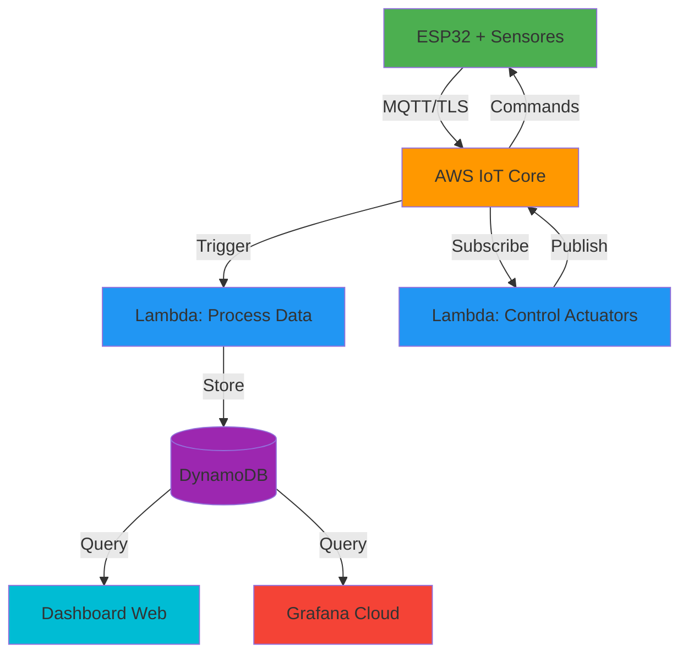

# 🌱 Invernadero-IoT

Sistema profesional de monitoreo y control IoT para invernaderos, utilizando ESP32 y AWS Free Tier.


## 📋 Descripción

Sistema completo de monitoreo y control automatizado para invernaderos que integra:
- **Hardware**: ESP32 con sensores ambientales
- **Cloud**: AWS IoT Core, Lambda, DynamoDB
- **Visualización**: Dashboard web en tiempo real y Grafana
- **CI/CD**: Pipeline automatizado con GitHub Actions

## ✨ Características

- 📊 **Monitoreo en tiempo real** de temperatura, humedad, luminosidad y humedad del suelo
- 🔄 **Control automático** de ventiladores, bombas de riego y luces
- ☁️ **Infraestructura cloud** escalable con AWS Free Tier
- 📱 **Dashboard responsive** accesible desde cualquier dispositivo
- 🔒 **Comunicación segura** MQTT sobre TLS 1.2
- 📈 **Almacenamiento histórico** de datos en DynamoDB
- 🚨 **Sistema de alertas** basado en umbrales configurables
- 🤖 **CI/CD automatizado** para firmware y funciones Lambda

## 🏗️ Arquitectura



## 🚀 Quick Start

### Requisitos Previos

- **Hardware**: ESP32, DHT22, sensor de humedad de suelo, LDR, relays
- **Software**: PlatformIO, Node.js 18+, AWS CLI
- **Cuenta AWS** con acceso a IoT Core, Lambda, DynamoDB

### Instalación

1. **Clonar el repositorio**
```bash
git clone https://github.com/tu-usuario/Invernadero-IoT.git
cd Invernadero-IoT
```

2. **Configurar AWS**
```bash
# Configurar credenciales AWS
aws configure

# Ejecutar script de setup
bash scripts/setup-aws.sh
```

3. **Configurar ESP32**
```bash
# Editar configuración
nano hardware/esp32/src/config.h

# Compilar y cargar firmware
cd hardware/esp32
pio run --target upload
```

4. **Abrir dashboard**
```bash
# Abrir en navegador
open dashboard/web/index.html
```

## 📁 Estructura del Proyecto

```
invernadero-iot/
├── .github/workflows/    # CI/CD con GitHub Actions
├── hardware/
│   ├── esp32/           # Firmware ESP32
│   └── circuitos/       # Diagramas de conexiones
├── cloud/
│   ├── lambda/          # Funciones Lambda
│   ├── iot-policies/    # Políticas AWS IoT
│   └── cloudformation/  # Infraestructura como código
├── dashboard/
│   ├── grafana/         # Dashboards Grafana
│   └── web/             # Dashboard web local
├── docs/                # Documentación
└── scripts/             # Scripts de automatización
```

## 📖 Documentación

- [Arquitectura del Sistema](docs/arquitectura.md)
- [Guía de Configuración](docs/guia-configuracion.md)
- [Documentación API MQTT](docs/documentacion-api.md)
- [README Hardware ESP32](hardware/esp32/README.md)

## 🔧 Tecnologías Utilizadas

**Hardware**
- ESP32 DevKit v1
- DHT22 (Temperatura y Humedad)
- Sensor de Humedad de Suelo
- LDR (Luminosidad)
- Relays 5V

**Cloud**
- AWS IoT Core
- AWS Lambda (Node.js 18)
- AWS DynamoDB
- AWS S3
- AWS CloudWatch

**Frontend**
- HTML5/CSS3/JavaScript
- Chart.js
- AWS SDK for JavaScript

**DevOps**
- GitHub Actions
- PlatformIO
- AWS CloudFormation

## 🌐 Topics MQTT

```
invernadero/sensores/temperatura
invernadero/sensores/humedad
invernadero/sensores/luminosidad
invernadero/sensores/humedad-suelo
invernadero/actuadores/ventilador
invernadero/actuadores/bomba
invernadero/actuadores/luces
invernadero/alertas
invernadero/estado
```

## 💰 Costos (AWS Free Tier)

- **IoT Core**: 500,000 mensajes/mes (gratis)
- **Lambda**: 1M requests/mes (gratis)
- **DynamoDB**: 25GB almacenamiento (gratis)
- **S3**: 5GB almacenamiento (gratis)
- **CloudWatch**: Incluido en Free Tier

**Costo estimado mensual**: $0 USD (dentro de Free Tier)

## 🤝 Contribuciones

Las contribuciones son bienvenidas. Por favor:

1. Fork el proyecto
2. Crea una rama para tu feature (`git checkout -b feat/nueva-funcionalidad`)
3. Commit con Conventional Commits (`git commit -m 'feat(sensores): agregar sensor CO2'`)
4. Push a la rama (`git push origin feat/nueva-funcionalidad`)
5. Abre un Pull Request

### Convenciones de Commits

- `feat`: Nueva funcionalidad
- `fix`: Corrección de bugs
- `docs`: Documentación
- `hw`: Cambios de hardware
- `ci`: Cambios en CI/CD
- `refactor`: Refactorización
- `perf`: Mejoras de rendimiento

## 📄 Licencia

Este proyecto está bajo la Licencia MIT. Ver [LICENSE](LICENSE) para más detalles.

## 👨‍💻 Autor

**Tu Nombre**
- GitHub: [@tu-usuario](https://github.com/tu-usuario)

## 🙏 Agradecimientos

- Comunidad ESP32
- AWS Free Tier
- PlatformIO
- Chart.js

---

⭐ Si este proyecto te fue útil, considera darle una estrella en GitHub!