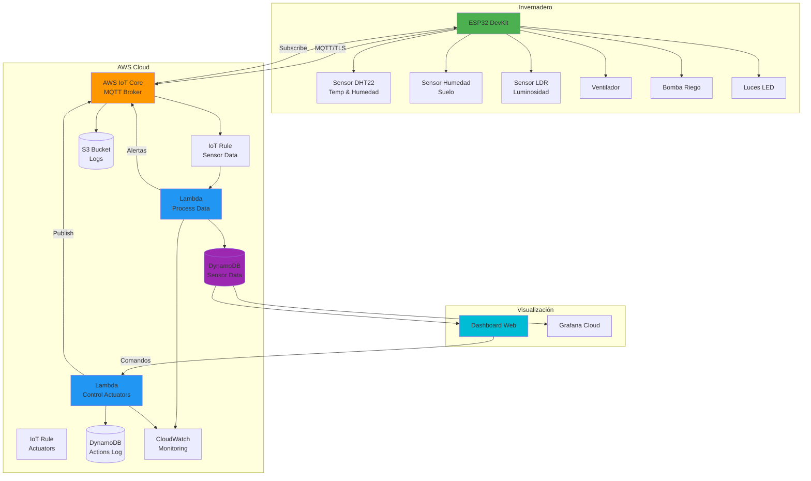

# Arquitectura del Sistema - Invernadero IoT

## Descripción General

Sistema IoT de monitoreo y control para invernaderos basado en arquitectura serverless con AWS Free Tier. Integra dispositivos ESP32, servicios cloud de AWS, y dashboards de visualización en tiempo real.

## Diagrama de Arquitectura



## Componentes del Sistema

### 1. Capa de Hardware (Edge)

#### ESP32 DevKit v1
- **Función**: Microcontrolador principal
- **Características**: WiFi 802.11 b/g/n, Dual-core, 520 KB SRAM
- **Responsabilidades**: Lectura de sensores, publicación MQTT, control de actuadores

#### Sensores
- **DHT22**: Temperatura (-40°C a 80°C) y Humedad (0-100%)
- **Sensor de Humedad de Suelo**: Analógico capacitivo
- **LDR**: Fotoresistencia para luminosidad

#### Actuadores
- **Ventilador, Bomba de Riego, Luces LED**: Control ON/OFF vía relay

### 2. AWS IoT Core
- **Función**: Broker MQTT administrado
- **Seguridad**: Autenticación X.509, TLS 1.2
- **Topics MQTT**:
  ```
  invernadero/sensores/{temperatura|humedad|luminosidad|humedad-suelo}
  invernadero/actuadores/{ventilador|bomba|luces}
  invernadero/{alertas|estado}
  ```

### 3. Funciones Lambda

#### Process Sensor Data
- **Trigger**: IoT Rule (topic: `invernadero/sensores/#`)
- **Funciones**: Validar datos, guardar en DynamoDB, evaluar umbrales, generar alertas

#### Control Actuators
- **Trigger**: API Gateway / Manual
- **Funciones**: Validar comandos, publicar a MQTT, actualizar Device Shadow, registrar acciones

### 4. Almacenamiento

#### DynamoDB Tables
- **Sensor Data**: Datos de sensores con TTL
- **Actuator Actions**: Log de acciones para auditoría

#### S3
- **Logs**: Almacenamiento con lifecycle de 90 días

### 5. Visualización

#### Dashboard Web
- HTML5/CSS3/JavaScript con Chart.js
- Visualización en tiempo real, gráficos históricos, control de actuadores

#### Grafana Cloud
- Paneles de valores actuales, gráficos de series temporales, alertas

## Flujo de Datos

### Sensores → Cloud
1. ESP32 lee sensores cada 30 segundos
2. Publica datos a AWS IoT Core vía MQTT/TLS
3. IoT Rule trigger Lambda Process Data
4. Lambda valida, guarda en DynamoDB, evalúa umbrales
5. Si excede umbrales, publica alerta a topic MQTT

### Control de Actuadores
1. Usuario envía comando desde dashboard
2. Lambda Control Actuators valida comando
3. Publica a topic MQTT del actuador
4. ESP32 recibe comando y ejecuta acción
5. Lambda registra acción en DynamoDB

## Seguridad

- **Autenticación**: Certificados X.509 para dispositivos
- **Autorización**: Políticas IAM y políticas IoT restrictivas
- **Cifrado**: TLS 1.2 en tránsito, AES256 en reposo

## Costos (Free Tier)

| Servicio | Free Tier | Uso Estimado | Costo |
|----------|-----------|--------------|-------|
| IoT Core | 500k msg/mes | 86,400 msg/mes | $0 |
| Lambda | 1M requests | ~3,000 requests | $0 |
| DynamoDB | 25 GB | ~1 GB | $0 |
| S3 | 5 GB | ~100 MB | $0 |
| **TOTAL** | | | **$0/mes** |

**Post Free Tier**: $2-5 USD/mes por dispositivo

## Escalabilidad

- **Horizontal**: Agregar más dispositivos ESP32
- **Vertical**: Aumentar frecuencia de lecturas
- **Geográfica**: Replicar en múltiples regiones

## Mejoras Futuras

- API Gateway REST + Cognito para autenticación
- SNS para notificaciones email/SMS
- Timestream para series temporales optimizadas
- Machine Learning con SageMaker para predicciones
- App móvil nativa
